# EDA app using Pandas-Profiling
A web app to perform basic EDA(Exploratory Data Analysis) on user uploaded file.

The app can be visited at https://eda-app-streamlit.herokuapp.com/

# About the App
This app is able to provide detailed EDA of the user uploaded file using Pandas Prafiling. The user is also able to process example dataset which is randomly generated. Wine quality dataset has been provided in the app.

This includes:
- Overview
- Detailed Variable description
- Interaction between any 2 specified Varibles
- Correlations
  - Pearson's r
  - Spearman's ρ
  - Kendall's τ
  - Phik (φk)
- Missing and Duplicate Values

# Screenshots of the web app:

<table style="width:100%">
  <tr>
    <th>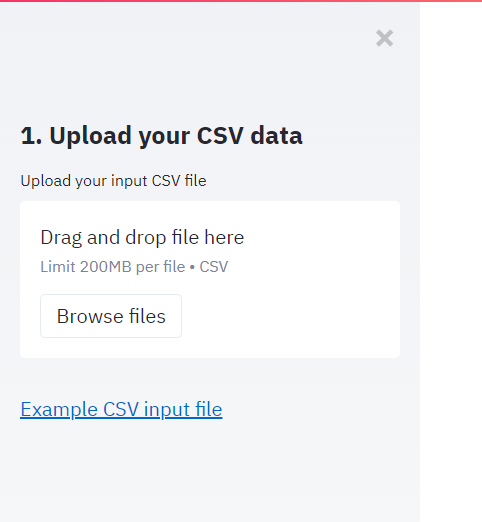</th>
    <th>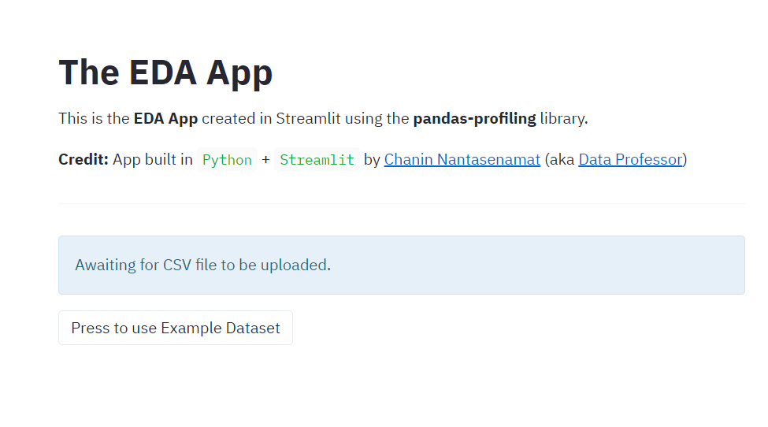</th>
  </tr>
  <tr>
    <th>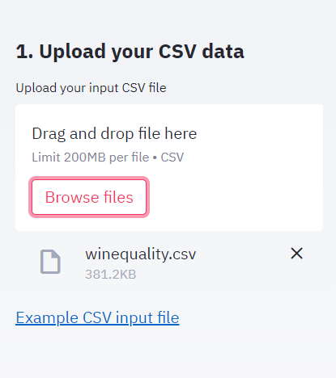</th>
    <th>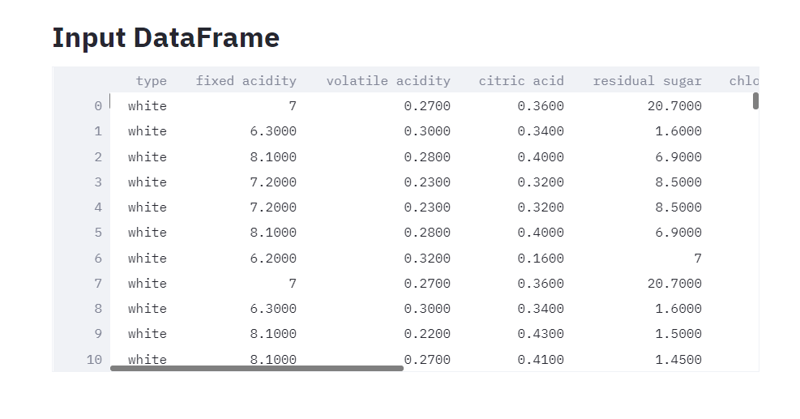</th>
  </tr>
  <tr>
    <th>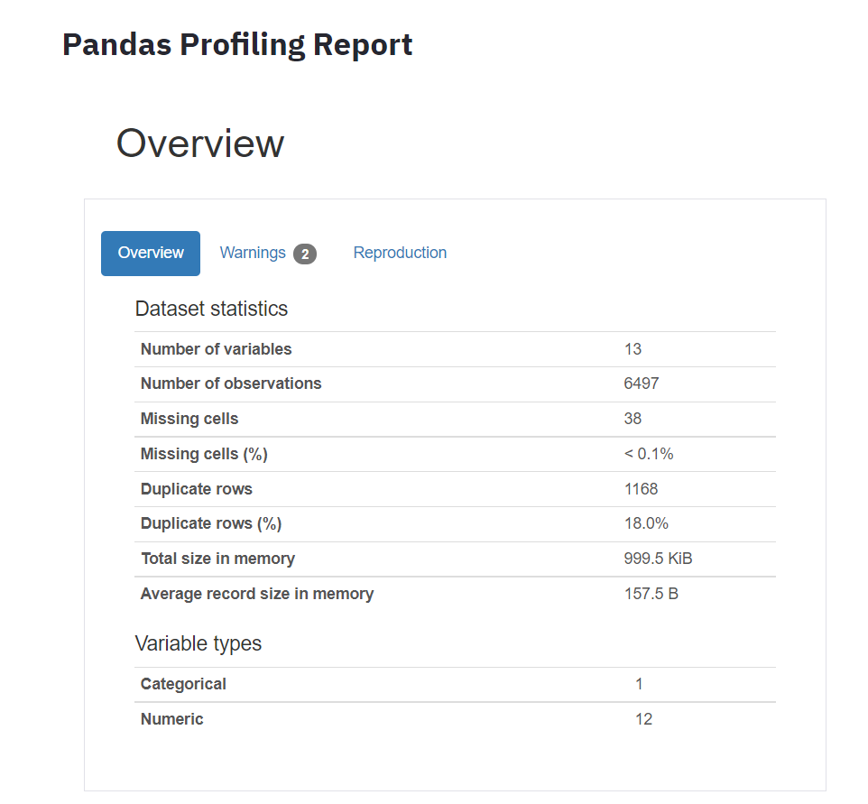</th>
    <th>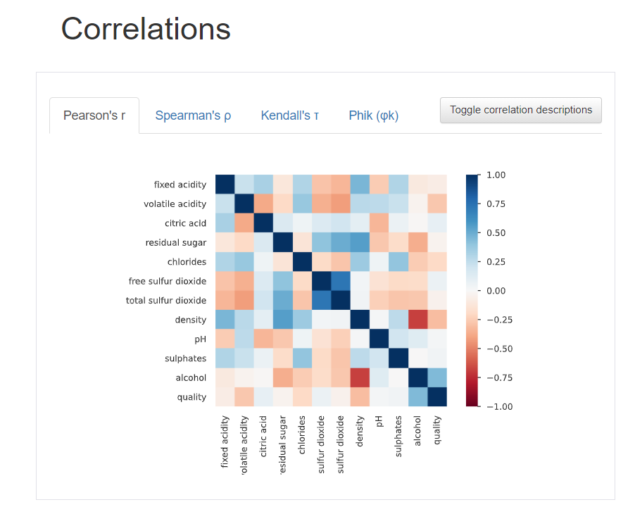</th>
  </tr>
  <tr>
    <th>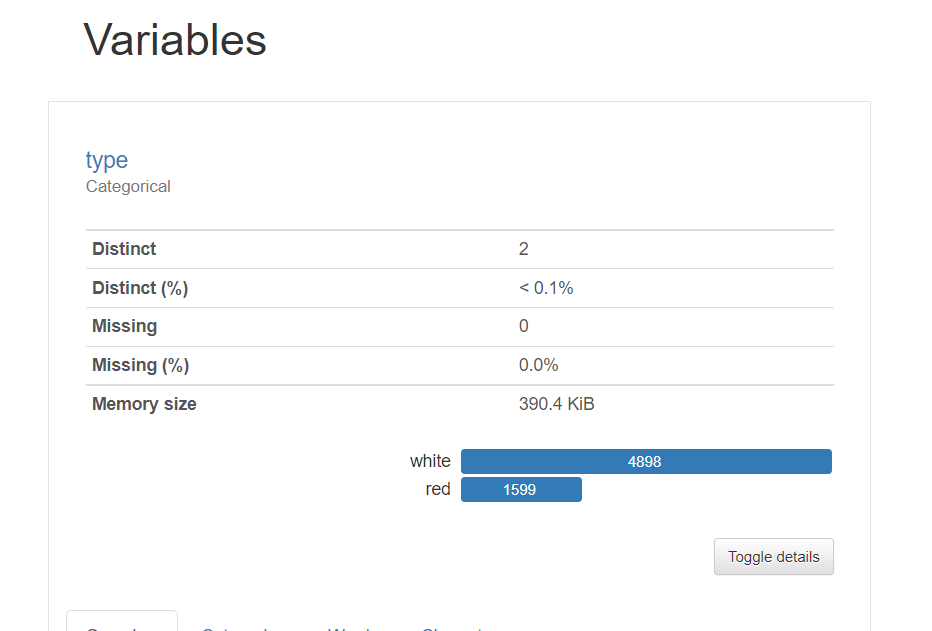</th>
    <th>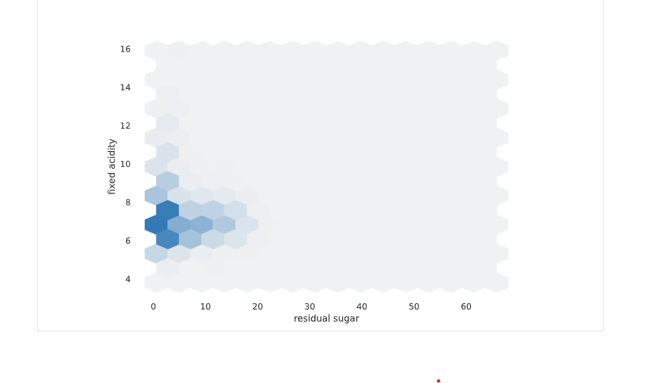</th>
  </tr>
  <tr>
    <th>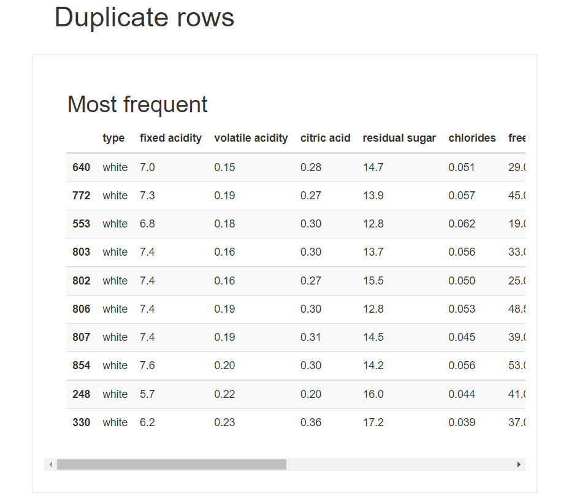</th>
    <th>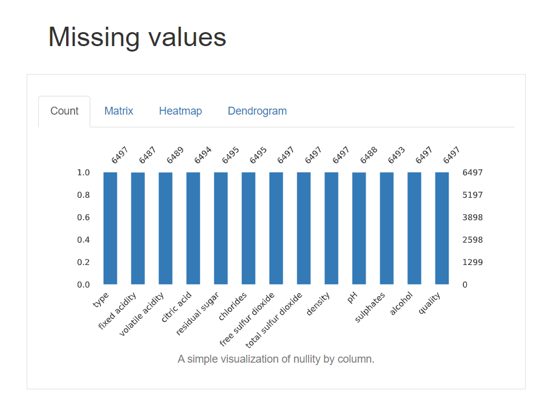</th>
  </tr>
 </table>
 
 
 # Flow Chart
 
 <table style="width:100%">
  <tr>
    <th>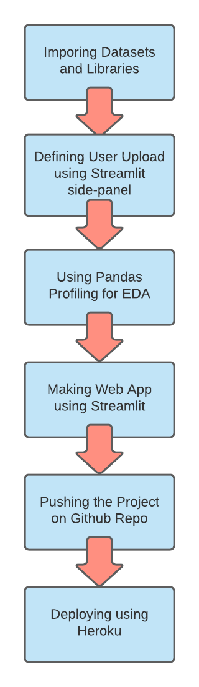</th>
  </tr>
 </table>
 
 

#  Data Source

Wine Quality Dataset from the UCI Machine Learning Repository.

P. Cortez, A. Cerdeira, F. Almeida, T. Matos and J. Reis.
Modeling wine preferences by data mining from physicochemical properties. In Decision Support Systems, Elsevier, 47(4):547-553, 2009.
 
 

